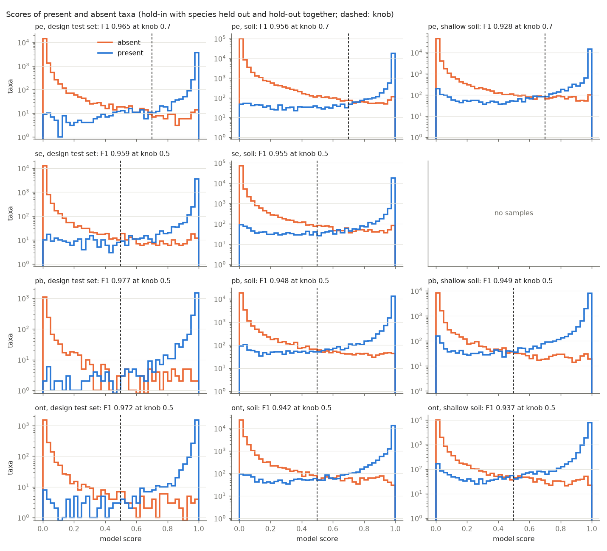
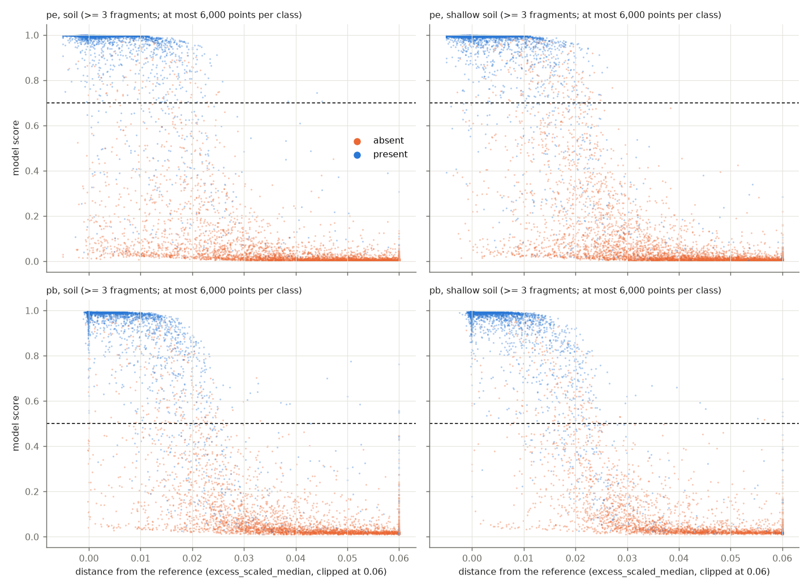

# The r226 v13 build: what goes wrong in the soil scenarios

**Data.** The r226 v13 build (SLURM 23984764, 2026-10-05/06, protal 0.7.7;
`local/protal_r226_v13_logs.tgz` and `_training.tgz`, extracted to `local/v13`): 24,980 species to simulate from
(~15,950 with real strains, 9,030 one-genome species with an in-silico strain), 10,600 held out of the training database,
the four default scenarios (3 hold-in, 2 hold-out samples each), scenario rows at weight 0.25, pe knob 0.70 (the
global knob), `--features auto` (the default set chosen for all four read types). For comparison the v12 build
(`local/v12`, [its report](../2026-10-05-r226-v12-scenarios/README.md)). Scripts here, run in WSL with the trainer of
`f30d8dc` (only its table loader is used):

    python3 soil_errors.py --build local/v13 --save v13_rows.tsv.gz > soil_errors_v13.txt   # and --build local/v12
    python3 soil_genus_context.py --rows v13_rows.tsv.gz > soil_genus_context_v13.txt
    python3 soil_divergence.py --rows v13_rows.tsv.gz > soil_divergence_v13.txt
    python3 soil_partition.py --rows v13_rows.tsv.gz > soil_partition_v13.txt
    python3 soil_experiments.py --training local/v13/training --test local/v13/test --out experiments -t 6
    python3 soil_experiments.py ... --out experiments_followup \
        --variants "v13,+ref,forest 512,gbm depth rounded,gbm +ref depth rounded"
    python3 summarize_runs.py experiments/runs.tsv > experiments/summary_from_runs.txt
    python3 score_shapes.py --rows v13_rows.tsv.gz --out .            # needs matplotlib
    python3 fp_top.py --build local/v13 --read-types pe,pb > fp_top_v13.txt
    python3 fp_consistency.py --build local/v13 > fp_consistency_v13.txt
    python3 top_fp_list.py --rows v13_rows.tsv.gz --out top_false_positives.tsv

The rows scored: the hold-in soil samples with species held out (`trained_model*.predictions.tsv.gz`, `p_species`),
the hold-out samples by the final model (`*.scenario_predictions.tsv.gz`), the design's test set
(`*.test_predictions.tsv.gz`), each joined row for row to its table; calls at the model's knob, as protal calls.
"Present" and "absent" are rows of the tables: taxa with reads in the sample.

## The scores, and why the model is not the limit

| read type | soil hold-out F1 (FP, FN) | in sample | best threshold | shallow soil hold-out F1 (FP, FN) | in sample | best threshold | design test |
|---|---|---|---|---|---|---|---|
| pe (knob 0.7) | 0.954 (304, 433) | 0.965 | 0.954 at 0.72 | 0.925 (331, 727) | 0.943 | 0.928 at 0.59 | 0.965 |
| se (Ultima) | 0.951 (434, 353) | 0.966 | 0.955 at 0.63 | | | | 0.959 |
| pb | 0.947 (322, 432) | 0.954 | 0.948 at 0.51 | 0.947 (178, 337) | 0.953 | 0.948 at 0.46 | 0.977 |
| ont | 0.941 (433, 426) | 0.947 | 0.942 at 0.53 | 0.934 (284, 404) | 0.945 | 0.936 at 0.40 | 0.972 |

"In sample": the hold-in samples scored by the final forest, which was fitted on them. It is only 0.003-0.013 above
the same samples with species held out (pe soil 0.958, shallow 0.930), and the hold-out samples score like the
species-held-out ones. The forest cannot separate soil's errors from its correct calls even on its own training
rows, and no threshold helps (best-threshold F1 within 0.003 of the knob's). What is missing is information in the
features, not a better fit or a better threshold; the experiments below confirm it.

## v12 to v13: the strains changed, not the model

Soil fell from v12 to v13 (hold-out pe 0.959 → 0.954, shallow 0.937 → 0.925; se 0.967 → 0.951; pb 0.961 → 0.947,
0.960 → 0.947; ont 0.953 → 0.941, 0.950 → 0.934). The present soil taxa are a different mix: v13's download has
16,000 species with real strains (v12: 6,000), so real strains are 46% of the present soil taxa against 17% in v12,
and in-silico strains 23% against 50%.

| pe, soil hold-in, species held out | v12: present, missed | v13: present, missed |
|---|---|---|
| representative | 3,976, 1.1% | 3,805, 2.0% |
| in-silico strain | 5,987, 1.7% | 2,906, 2.4% |
| real strain | 2,026, 6.3% | 5,838, 7.5% |

Per kind the miss rates moved little (pb, knob 0.5 in both: real strains 9.7% → 8.9%, in-silico 3.1% → 3.8%); pe's
rose (representatives 1.1% → 2.0%, real strains 6.3% → 7.5%), its knob 0.7 against v12's 0.5 trading false
positives (613 → 456) for misses. Real strains are missed 2-5 times as often as representatives or in-silico strains,
and v13 has nearly three times as many, so v13's soil score is the more honest one.

## What the errors are

Every soil error falls in one of a few classes (`soil_partition.py`; first match wins for the misses):

| | pe soil | pe shallow | se soil | pb soil | pb shallow | ont soil | ont shallow |
|---|---|---|---|---|---|---|---|
| FN, all (hold-out) | 433 | 727 | 353 | 432 | 337 | 426 | 404 |
| 1-2 fragments | 117 | 447 | 87 | 177 | 222 | 206 | 278 |
| divergent strain (excess_scaled_median > 0.015) | 215 (151 real) | 196 (127 real) | 185 (132) | 232 (171) | 109 (78) | 185 (129) | 110 (69) |
| beside a called congener with >= 5x its fragments | 67 | 43 | 59 | 12 | 1 | 16 | 5 |
| other | 34 | 41 | 22 | 11 | 5 | 19 | 11 |
| FP, all (hold-out) | 304 | 331 | 434 | 322 | 178 | 433 | 284 |
| congener of a novel species that is near-identical on the markers (<= 0.015) | 216 | 253 | 254 | 228 | 124 | 329 | 199 |
| congener of a more divergent novel species | 85 | 67 | 173 | 84 | 52 | 90 | 83 |
| other | 3 | 11 | 7 | 10 | 2 | 14 | 2 |

F1 if a class were gone (ceilings; hold-out):

| | pe soil | pe shallow | se soil | pb soil | pb shallow | ont soil | ont shallow |
|---|---|---|---|---|---|---|---|
| as built | 0.954 | 0.925 | 0.951 | 0.947 | 0.947 | 0.941 | 0.934 |
| without the divergent-strain misses | 0.968 | 0.940 | 0.963 | 0.964 | 0.959 | 0.954 | 0.945 |
| without the 1-2-fragment misses | 0.961 | 0.958 | 0.957 | 0.960 | 0.971 | 0.956 | 0.962 |
| without the near-identical relatives' FP | 0.967 | 0.942 | 0.966 | 0.962 | 0.960 | 0.963 | 0.952 |

### The false positives: relatives the database lacks

95-99% of soil's false positives are database species of a genus with a species the database lacks in the sample
(`meta_novel_level` species, `meta_relative_rank` genus): its reads land on its congeners, and with 60% of ~10,000
species lacking, every soil sample has ~6,000 such sources. Most (59-76%) are congeners of a novel species that is
near-identical on the marker genes (excess_scaled_median <= 0.015). In that divergence range the present strains
outnumber them and the forest calls 10-14% of them (pe deep soil); above 0.02 it calls almost none. 53-60% sit in a
genus that also has a present database species in the sample. Of the false positives in the design's test set, 82%
are of the same kind; soil has more because each of its samples holds thousands of such sources.

### The misses in deep soil: strains far from the one reference

At 20M reads a soil sample's present taxa mostly have 10-99 fragments; the misses are not thin. In pe deep soil:
- 70-75% of the misses are real strains (rate 7.5-8.3%; representatives 2.0-2.6%, in-silico strains 2.4-3.5%).
- The miss rate climbs with the reads' divergence from the reference (excess_scaled_median): real strains with >= 3
  fragments 0.7% at <= 0.0025, 5.5% at 0.005-0.01, 13.9% at 0.01-0.015, 35.5% at 0.015-0.02, 86.6% at 0.02-0.03, all
  beyond. The absent congeners of novel species fill exactly that range: 4,670 rows at 0.02-0.03, 11,343 at
  0.03-0.05 (`soil_divergence_v13.txt`). A strain 2-3% from its reference looks like a sister species.
- Which strains are that far: those of wide GTDB species clusters. Real strains with >= 10 fragments are missed 22.9%
  of the time when the cluster's minimum intra-species ANI is below 96%, 9.7% at 96-97%, 3.7% at 97-98%, 1.9% at
  98-99%, 0.8% at >= 99%. A wide cluster's real member can be 4-5% from the representative, the only genome the index
  holds (the converter indexes the representatives' marker genes; `--full_reference` is read only at build time).
- 73% of the misses have a called present congener in the same sample, with a median 14 times their fragments; their
  low-MAPQ share is 0.63 (found taxa 0.04): their reads tie with the congener's reference and fall to the MAPQ filter.
  The divergent strains and these overlap: a strain far from its own reference is nearer its congeners'.
- In-silico strains are easier than real ones at the same identity (identity 0.96-0.97: 28% missed against 54%),
  because insilico_strains.py diverges every gene from the representative by its factor, so they are never nearer
  another species' reference in a gene, while real strains are.

### The misses in shallow soil: too few reads

At 5M pairs (1.5 Gb for long reads) 60% of pe's misses (66-69% for long reads) have one or two fragments: pe misses 51%
of the present taxa with one fragment, 20% with two. A taxon of one read in a sample of ~10,000 species, 60% of
them lacking, cannot be called reliably: the absent rows with one fragment outnumber the present ones 20 to 1. The
divergent strains add the same ~110-200 misses as in deep soil.

## The scores: no S to cut at

[`score_shapes.py`](score_shapes.py) draws the models' scores per environment ([`score_histograms.png`](score_histograms.png))
and against the distance from the reference ([`score_vs_distance.png`](score_vs_distance.png)), and tries cuts other
than the knob ([`score_cuts_v13.txt`](score_cuts_v13.txt)).

In the design's test set the two classes pile up at 0 and 1 with a thin trough between. In soil they don't: between
~0.2 and ~0.9 present and absent taxa lie in a flat plateau at about the same height (50-100 taxa per bin each). In
the five samples of each soil environment and read type 3,000-5,900 taxa score in that band (present to absent: long
reads 1:1 to 1.8:1, se 1:2, pe 1:3.5 in soil and 1:1.4 in shallow soil), and 58-68% of all soil errors are there.
Wherever the cut falls in the plateau it trades false positives for misses about one for one.

The forest's score already falls with the distance from the reference, steeply between 0.01 and 0.03; in that band
present and absent taxa are mixed at every score. (The plot draws at most 6,000 taxa per class; absent taxa are 3-6
times more numerous than drawn.)

F1 on the hold-out samples (soil, shallow soil) and the design test set, by cut:

| | knob | valley per sample | best single threshold (oracle) | by distance bin | by fragment bin | by distance x fragments | the same three, oracle |
|---|---|---|---|---|---|---|---|
| pe soil | 0.9535 | 0.9474 | 0.9540 | 0.9528 | 0.9524 | 0.9535 | 0.9555 / 0.9546 / 0.9583 |
| pe shallow | 0.9253 | 0.8773 | 0.9275 | 0.9267 | 0.9269 | 0.9266 | 0.9298 / 0.9307 / 0.9336 |
| se soil | 0.9511 | 0.9440 | 0.9544 | 0.9540 | 0.9539 | 0.9528 | 0.9561 / 0.9556 / 0.9585 |
| pb soil | 0.9469 | 0.9466 | 0.9471 | 0.9467 | 0.9477 | 0.9467 | 0.9483 / 0.9487 / 0.9519 |
| pb shallow | 0.9474 | 0.9452 | 0.9475 | 0.9468 | 0.9470 | 0.9472 | 0.9492 / 0.9483 / 0.9528 |
| ont soil | 0.9412 | 0.9377 | 0.9416 | 0.9414 | 0.9406 | 0.9398 | 0.9425 / 0.9427 / 0.9464 |
| ont shallow | 0.9339 | 0.9355 | 0.9358 | 0.9349 | 0.9351 | 0.9350 | 0.9385 / 0.9380 / 0.9431 |
| pe design test | 0.9652 | 0.9569 | 0.9655 | 0.9651 | 0.9654 | 0.9646 | 0.9681 / 0.9673 / 0.9711 |

- **Valley per sample** (unsupervised: the lowest point of the smoothed density of logit(score) between the two
  modes, where the sorted scores' S curve is steepest): worse than the knob in 10 of 11 sets. In soil the absent
  mode is several times the present one, so the density's minimum sits high (pe 0.88-0.96) and misses the plateau's
  present taxa; F1's optimum depends on the classes' ratio, not on where the density is lowest. A two-Gaussian
  mixture on logit(score) does not fit these shapes at all (one broad component swallows the other).
- **Thresholds per bin** of distance, of fragments, or of both (7 x 6 cells), learned on the soil and shallow-soil
  hold-in samples (species held out) and applied to the hold-out ones: -0.0014 to +0.0029 in soil (-0.005 to +0.002
  on the design test sets), within 0.0006 of the best single threshold. The learned thresholds do rise with distance
  for pe and se (0.575 below 0.005, 0.80 at 0.01-0.03) and stay near 0.5 for long reads.
- **Their oracles** (thresholds fitted on the hold-out samples themselves, optimistic): +0.001-0.005 per bin of one
  dimension, +0.005-0.009 for the 42 cells of both. That is the most any cut of the plane can give, and the honest
  version gives almost none of it.

The cut is not where soil's F1 is lost: the scores put present and absent taxa in the same place.

## Experiments: other models, features and weights

[`soil_experiments.py`](soil_experiments.py) refits each read type's model on the v13 training table (one seed) and
scores it with species held out (5 folds by taxon) and on the test table; the knob is chosen as the trainer chooses
it. Its `v13` variant reproduces the build's numbers exactly. Results: [`experiments/runs.tsv`](experiments/runs.tsv),
[`experiments/summary_from_runs.txt`](experiments/summary_from_runs.txt) (the run was stopped before its last
variant, pe `+context gbm`), follow-up in [`experiments_followup/`](experiments_followup). F1 change against v13 on
the hold-out samples and the design's test set (one seed: on two soil samples +-0.003 is noise; the v12 report
measured SDs up to 0.016 there):

| variant | pe soil / shallow / design / gut | se soil / design | pb soil / shallow / design / gut | ont soil / shallow / design / gut |
|---|---|---|---|---|
| scenarios at weight 1 | +.002 / +.001 / -.001 / -.001 | +.005 / -.001 | +.001 / +.001 / -.003 / +.001 | -.002 / +.003 / .000 / -.003 |
| soil rows only | +.002 / +.001 / -.012 / -.004 | +.004 / -.096 | .000 / .000 / -.003 / -.005 | -.002 / +.003 / -.003 / -.006 |
| + GTDB priors | +.001 / +.004 / +.003 / +.001 | +.003 / +.001 | +.001 / +.002 / .000 / -.001 | +.002 / +.001 / .000 / +.003 |
| every feature ("all") | +.002 / +.002 / +.003 / .000 | +.003 / +.004 | +.003 / +.001 / .000 / -.001 | +.001 / +.003 / +.002 / +.003 |
| sample and genus context (7 features) | -.001 / .000 / .000 / .000 | .000 / -.001 | .000 / +.001 / -.001 / .000 | -.001 / +.001 / -.001 / +.002 |
| 256 trees of 4,096 leaves | .000 / +.003 / +.001 / +.001 | +.004 / .000 | +.003 / +.003 / +.002 / +.004 | +.002 / +.005 / +.002 / +.011 |
| gradient boosting (500 rounds, 63 leaves) | +.002 / **-.045** / .000 / -.002 | +.005 / +.002 | +.004 / +.004 / +.003 / +.008 | +.004 / +.008 / +.003 / +.013 |
| gradient boosting, the sample's depth rounded to 0.25 | +.004 / +.006 / +.002 / -.002 | | | |
| + reference k-mer uniqueness (`*_rate_ref`) | .000 / .000 / +.001 / .000 | | | |

- Training on soil alone, weighting its rows fully, the GTDB priors, every feature of the table, or the context
  features (the sample's taxa, its low-identity share and median identity, the taxon against its genus's most
  abundant congener and best identity): within +-0.005 in soil, at a cost elsewhere for some.
- A bigger forest helps long reads a little (pb and ont have 128 leaves now).
- Gradient boosting is the one change that gains on every set for long reads (soil +0.004 to +0.008, design test
  +0.003, gut +0.008 to +0.013) and for Ultima (+0.005 soil, +0.002 design). For pe it collapses on the shallow-soil
  hold-out samples: their best threshold is 0.15 against 0.78 on the shallow hold-in samples.
- **Why: a scenario sample's depth identifies it.** Every scenario sample is one value of `sample_log_fragments`
  over 30,000-60,000 rows, and its preset fixes the depth: the shallow hold-in samples sit at 5.141-5.178, the
  hold-out ones at 5.180-5.195, outside them (deep soil: 5.791-5.796 against 5.773-5.782). A model can learn
  per-sample offsets on that feature, and cross-validation by species does not see it (every sample is in every
  fold). Boosting exploits it; the forest less (its "samples held out" estimate is still below the species-held-out
  one: pe shallow 0.925 against 0.930). Rounding `sample_log_fragments` to 0.25 (5.14-5.19 all become 5.25) confirms
  it: pe's boosted model then scores the shallow hold-out samples 0.931 (0.881 with the exact depth, the forest
  0.925), and gains everywhere but gut.

## The top-scored false positives

[`fp_top.py`](fp_top.py) ([`fp_top_v13.txt`](fp_top_v13.txt)) lists them and compares them with true positives at
the same score; [`top_false_positives.tsv`](top_false_positives.tsv) has the 30 highest per read type and soil
environment with the taxid that names their genes in the SAM files.

- Half of pe's soil false positives score above 0.86, a tenth above 0.99. The highest are a few taxa again and
  again: Coproplasma sp948890655, Lactobacillus sp946579245 and Obscuribacter phosphatis_A are false positives in all
  five soil samples, Intestinibacter sp937944945 and Parvarchaeum sp023488405 in four, none present in any sample.
  Their reads match at identity 0.98-0.99, divergence 0-0.008, up to 191 fragments over 77% of the genes: a sister
  species the database lacks that is near-identical on the marker genes.
- Against true positives scored as high and matched on fragments, the features separate them well (a classifier of
  every feature: AUC 0.95; identity, `excess_*`, `third_position_share` differ most), but most such true positives
  are representatives at no divergence. Matched on divergence too (true positives then mostly real and in-silico
  strains), they still separate (AUC 0.80-0.88): the reads' ambiguity (`congener_fit_share` 0.13 against 0.02,
  `low_mapq_share` 0.23 against 0.05, mean MAPQ 58 against 84, `em_own_share`) and the reference's k-mer uniqueness
  in the database (`uniqueness` 0.71 against 0.89, `lu_rate_ref` 0.64 against 0.77, `lu_genome`): these taxa have
  close relatives in the database too.
- Among all the taxa a soil sample calls, a second model of every feature fitted on soil's called taxa (5 folds by
  taxon) ranks the false positives above the true ones better than the model's score: AUC pe 0.976 against 0.948,
  pe shallow 0.955 against 0.928, pb 0.958 against 0.933, pb shallow 0.923 against 0.919. Part of that may be the
  sample's depth identifying the sample (above), so it is a hint, not a gain.

## Are the problem taxa consistent, and could the build know them?

[`fp_consistency.py`](fp_consistency.py) ([`fp_consistency_v13.txt`](fp_consistency_v13.txt)):

- **Yes, within an environment.** An absent taxon that was a false positive in another soil sample is one again
  32% of the time (pe; se 31%, pb 34%, ont 28%) against 0.2-2% otherwise; 60% of pe's and se's soil false positives
  are in recurring taxa (pb and ont 38-40%). Even across the design's independent communities the rate is 13-37%
  against 0.5-3%.
- **But because the sources recur.** The soil samples draw 10,000 of the same 13,148 species, so the same lacking
  relatives are in every sample; the design's samples share the build's 10,600 held-out species.
- **What a per-taxon prior could give, at most.** Vetoing the calls of taxa that were false positives in the soil
  hold-in samples raises the hold-out F1 by +0.005 to +0.012 (pe 0.954 → 0.962, se 0.951 → 0.963, pb 0.947 → 0.952,
  ont 0.941 → 0.948; shallow +0.003 to +0.005), a prior that knows which relatives the sample's database lacks. Learned
  from the design's samples instead (other communities, the same held-out species) it gives pe and se +0.003, long
  reads nothing (4-6% of soil's called taxa were ever absent in a long-read design sample).
- **A prior from simulations would learn the wrong thing.** The false positives come from this build's held-out
  species; in the shipped database those species are present and take their own reads. A build-time prior has to
  describe a species from the database alone: how unique its reference's k-mers are in the index (already computed,
  `su/lu/lsu_rate_ref`, not in the default set; `+ref` above: no gain for pe), or how many of its database sisters'
  reads it takes when each sister is left out in turn (a "spill" score from the database's own genomes; not computed
  yet). The propensity experiment bounds such a prior at about +0.003.

## The SAM records

They are not in `local/v13` (logs and tables only). The collector deletes each point's reads once profiled but keeps
protal's SAMs: the build's last line says 29.2 GB of them stay in `/nbi/local/ssd/23984764/protalDBbuild_1`
(`training/` 18.7 GB, `test/` 10.4 GB), on q512n22's local SSD, which may have been wiped when the job ended. If it
is still there, the soil samples' SAMs are `<training|test>/points/sc_soil_pe_p20000000/protal/alignments/
sc_soil_pe_p20000000_s_<n>.sam.gz` (or `.sam.zst`; `find .../points/sc_soil* -name "*.sam*"` shows them). References
are named `<taxid>_<geneid>`, and `top_false_positives.tsv` gives each false positive's collection, point, sample and
taxid. To read a taxon's records and every other record of the same reads (where else they fit):

    taxid=36854; sam=.../test/points/sc_soil_pe_p20000000/protal/alignments/sc_soil_pe_p20000000_s_1.sam.gz
    zcat $sam | awk -F'\t' -v t="$taxid" '!/^@/ && index($3, t "_") == 1 {print $1}' | sort -u > reads.txt
    zcat $sam | awk -F'\t' 'NR==FNR {r[$1]; next} !/^@/ && ($1 in r)' reads.txt - > taxon_$taxid.sam

The truth of the sample (which genomes, at what abundance) is in the point's `sim/` folder; the held-out species
nearest the taxon is its likely source.

## What would raise soil's F1

In order of what they are worth against what they cost:

1. **Vary the scenarios' depths, and simulate more scenario samples.** Draw each scenario sample's depth around the
   preset's (say lognormal, +-50%) and simulate 6-10 hold-in samples instead of 3. The depth then no longer
   identifies a sample, the species-held-out estimates stop flattering, any more flexible model becomes safe, and
   real studies vary in depth anyway. A change of `scenarios.py` and the build's defaults, at more simulation time.
2. **Gradient boosting, once 1 is done** (or with the depth coarsened): long reads +0.004 to +0.008 in soil, +0.003
   on the design's test set, +0.008 to +0.013 on gut; Ultima +0.005 and +0.002; pe with the depth rounded +0.004 in
   soil, +0.006 in shallow soil, +0.002 on the design's test set; one seed. cPMML scores a boosted model
   (MiningModel modelChain); the repository has older exporters (`scripts/gradient_boosted_cmdline.py`,
   `hist_gradient_boosted_cmdline.py`); the trainer, the parity check and the PMML writer would need it.
3. **Strain alleles in the index** for wide species clusters (minimum ANI < 97%): the marker genes of one or two
   more members from `--full_reference`, mapped to the same taxon, the simulated genome excluded. The divergent-strain
   misses are 110-232 per two soil samples; without them soil's F1 would be +0.012 to +0.017 (shallow +0.011 to
   +0.015), the design's test set +0.004 to +0.006. It costs index memory and code that lets a taxon's gene have
   several alleles; a novel species nearer a member than the representative will be called more often, which the
   simulation measures.
4. **Evidence beyond the marker genes.** What the top false positives lack is the species boundary itself: their
   source differs from them by more than 5% over the genome (another GTDB species) but by under 1% on the 120
   bacterial (53 archaeal) markers, which are among the most conserved genes and ~3% of a genome; no feature of
   marker reads can tell such a sister species from a strain. The same 3% is why shallow soil's taxa have one or two
   fragments. A genome-wide sketch of the representatives (k-mer containment and its ANI per candidate taxon, as
   sylph estimates it) would give both the boundary and ~30 times the reads per taxon. Ceiling: the near-identical
   relatives' false positives are +0.012 to +0.022 of soil's F1, the one-or-two fragment misses +0.023 to +0.033 of
   shallow soil's. The largest change of these: a second index and a decision about what protal is.
5. **A build-time spill prior** (each species' share of its database sisters' reads when they are left out in
   turn): unbiased, computable from the database alone, but bounded at about +0.003 by the propensity experiment.

Not worth pursuing for soil: a different knob or per-sample cut, cuts by distance, fragments or depth, the sample
and genus context features, soil-only models, the reference k-mer uniqueness as features of a forest, the GTDB
priors.

## Follow-up: the depth fixed, and boosting with the reference's uniqueness

[`experiments_followup/`](experiments_followup) ([`summary_from_runs.txt`](experiments_followup/summary_from_runs.txt)):
the same refits with `sample_log_fragments` rounded to 0.25 (what varied scenario depths will do), and with the
reference's k-mer uniqueness in the index (`su_rate_ref`, `lu_rate_ref`, `lsu_rate_ref`: shares of the species'
reference k-mers unique in the database, a build-time property that does not depend on how many genomes a species
has). F1 change against v13 (one seed):

| | pe soil / shallow / design / gut | se soil / design | pb soil / shallow / design / gut | ont soil / shallow / design / gut |
|---|---|---|---|---|
| forest + uniqueness | .000 / .000 / +.001 / .000 | +.002 / +.001 | +.001 / +.002 / -.001 / .000 | -.001 / +.002 / +.001 / +.001 |
| forest of 512 leaves | (pe has 512) | (se has 512) | +.001 / +.001 / +.001 / +.002 | +.001 / +.003 / +.003 / +.005 |
| boosting, depth rounded | +.004 / +.006 / +.002 / -.002 | +.006 / +.001 | +.005 / +.004 / +.003 / +.005 | +.006 / +.008 / +.004 / +.007 |
| boosting + uniqueness, depth rounded | +.007 / +.009 / +.001 / -.002 | +.007 / +.004 | +.008 / +.006 / +.004 / +.006 | +.007 / +.010 / +.006 / +.007 |

With the depth no longer naming a sample, boosting gains on every soil and design set of every read type; the
reference's uniqueness adds 0.002-0.003 in soil on top of it (not with a forest).

## Follow-up: implemented

1. **Varied scenario depths and more scenario samples** (`scripts/scenarios.py`, `collect_training_data.py`,
   `simulate_metagenomes`): each scenario sample's depth is its preset's times a factor from 1/2 to 2
   (`depth_spread`, default 2; log-uniform and stratified, `scenarios.depth_factors`), the same factor for
   sample s of every technology; `simulate_metagenomes --total_read_pairs` takes one value per sample (as
   `--pln_sigma` does). The build's defaults are 6 hold-in and 3 hold-out samples per scenario (3 and 2 before).
2. **Gradient boosting as the default model** (`machine_learning_cmdline.py --model gbm`, `build_gtdb_database.py
   --model`, `--rounds`): `HistGradientBoostingClassifier` with the settings above (500 rounds, rate 0.05, 63
   leaves, min leaf 20, L2 1), written by `model_pmml.write_boosted` as a chain of regression trees into a logit
   RegressionModel; `model_pmml.PmmlBoosted` scores it as cPMML does, and `load_model` reads either model. Bit for
   bit with scikit-learn (unit tests; the trainer's own check on every training row) and with protal (the GTDB build
   test's parity step, which fails on any difference). `--model forest` keeps the forest.

The reference's uniqueness is not in the default feature set; a `ref` group among `--features auto`'s candidates
would let the trainers take it where it gains.
